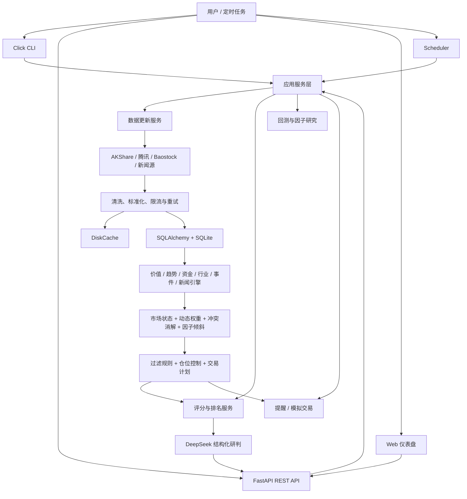

# AI 量化选股分析系统 - 简历项目介绍

> 本文档面向简历撰写、项目总结和技术面试。文中的测试数据均来自项目现有验收记录；涉及个人职责、项目周期和部署环境的内容，请根据实际经历选择或替换，不建议把研究系统描述为已接入真实券商的实盘系统。

## 1. 项目定位

**项目名称：** AI 量化选股分析系统（AI Stock Analyzer）

**项目类型：** A 股量化研究、规则选股、风险控制与 AI 辅助研判平台

**代码仓库：** [minsops/ai-stock-analyzer](https://github.com/minsops/ai-stock-analyzer)

**推荐角色描述：** 负责需求拆解、系统架构设计、后端开发、量化研究、测试验证与容器化部署

**技术栈：**

- Python 3.11+、pandas、NumPy、TA
- FastAPI、Pydantic 2、Click、Rich
- SQLAlchemy 2、SQLite、Alembic、DiskCache
- AKShare、Baostock、腾讯行情接口
- DeepSeek OpenAI-compatible API、httpx
- pytest、pytest-cov、Docker、Docker Compose
- 原生 HTML/CSS/JavaScript 服务端仪表盘

该项目面向 A 股日频研究场景，将行情、财务、估值、资金、行业和新闻数据统一落入本地数据库，通过 6 类评分引擎、市场状态识别、动态权重、冲突消解和风险过滤生成股票评分、排名与仓位建议，并提供回测、因子 IC 研究、DeepSeek 结构化分析、Web API、命令行工具、定时任务、自选股和模拟交易能力。

项目的核心目标不是用大模型直接预测涨跌，而是建立一条**可解释、可回测、可降级、可审计**的选股工程链路：量化规则负责评分和约束，DeepSeek 只基于结构化量化结果生成自然语言研判，不参与核心分数计算。

## 2. 可直接放入简历的版本

### 2.1 推荐详细版

**AI 量化选股分析系统｜Python / FastAPI / SQLAlchemy / pandas / DeepSeek**

`[项目周期]`　`[个人项目 / 课程项目 / 团队项目]`

- 设计并实现面向 A 股的本地量化研究平台，打通行情采集、数据清洗、因子评分、全市场排序、风险控制、回测研究、AI 研判和可视化展示链路，形成 CLI、REST API、Web 仪表盘和定时任务四类使用入口。
- 基于策略模式拆分价值、趋势、资金、行业、事件和新闻 6 类评分引擎，统一输出评分、置信度、信号和数据可用性；结合牛市、震荡、熊市及极端情绪状态动态调整权重，并通过冲突消解和硬性风控规则生成最终排名与仓位建议。
- 构建 AKShare 主数据源、腾讯行情及 Baostock 备用源的容错采集链路，实现进程级共享限流、超时重试、磁盘缓存、数据清洗和 SQLAlchemy 持久化；将“网络采集”和“本地评分”解耦，避免扫描数千只股票时逐股请求外部接口。
- 实现 point-in-time 回测和因子研究框架，支持历史成分股、交易成本、滑点、印花税、周/月调仓、IC、Rank IC、IR、t 统计量、行业与市值中性化及滚动样本外验证；通过研究审计识别原始组合中的市场 Beta 和幸存者偏差，增加可配置因子倾斜模块。
- 使用 FastAPI、Pydantic 2 和 SQLAlchemy 2 构建 19 条业务 API、14 个 CLI 命令和 9 张业务表，使用 Alembic 管理数据库迁移；实现参数校验、HTML 转义、安全响应头和密钥环境变量隔离。
- 接入 DeepSeek OpenAI-compatible API，将量化评分、风险指标和估值信息组织为结构化上下文，生成中文评级、多空因素和操作建议；当模型接口不可用时自动降级，不阻断本地评分主流程。
- 建立 187 个自动化测试，整体覆盖率达到 80.69%；本地基准测试中 1,000 只股票、180 个交易日、6 引擎加因子倾斜的扫描耗时 13.175 秒，评分阶段外部网络请求为 0，5,000 条排行查询平均耗时 1.622 ms。

### 2.2 一页简历精简版

**AI 量化选股分析系统｜Python、FastAPI、SQLAlchemy、pandas、DeepSeek**

- 构建 A 股本地量化研究平台，集成多源行情采集、6 类可解释评分引擎、市场状态动态权重、风险过滤、回测、因子研究、AI 研判及 Web/CLI 使用入口。
- 采用“数据预先入库、评分只读本地”的架构，结合限流、重试、缓存和多数据源回退提升稳定性；1,000 只股票本地扫描耗时 13.175 秒，评分阶段外部请求为 0。
- 完成 19 条业务 API、14 个 CLI 命令、9 张业务表和 187 个自动化测试，测试覆盖率 80.69%，并通过 Alembic 与 Docker Compose 支持可重复部署。

### 2.3 三句话极简版

1. 使用 Python、FastAPI、SQLAlchemy 和 pandas 开发 A 股量化选股系统，覆盖数据采集、评分排名、风控、回测、因子研究与仪表盘。
2. 将 6 类规则引擎与市场状态动态权重、冲突消解和因子倾斜结合，实现可解释、可降级的本地选股链路。
3. 通过多源回退、缓存、迁移和 187 个测试保障工程质量，1,000 只股票本地扫描耗时 13.175 秒，覆盖率 80.69%。

## 3. 项目背景与需求拆解

传统股票筛选脚本通常存在以下问题：

- 数据源不稳定，一个上游接口异常就会导致整个任务失败。
- 评分过程与网络请求耦合，全市场扫描时性能和成功率不可控。
- 缺失数据被简单填零，导致“无数据”被误判为“中性信号”。
- 单一总分缺少市场环境、行业暴露、仓位上限和冲突信号约束。
- 回测容易引入未来函数、幸存者偏差和未计交易成本等失真因素。
- 大模型直接参与打分时难以复现，也无法保证输出稳定性。
- 脚本缺少 API、数据库迁移、自动化测试和部署能力，难以持续演进。

因此，项目被拆分为数据层、评分引擎层、融合决策层、研究回测层、风险与交易层、接口层和运维层。每一层通过明确的数据结构通信，确保数据采集异常、单个因子缺失或 LLM 不可用时，系统仍能输出可解释结果。

## 4. 整体架构



### 4.1 分层职责

| 层级 | 主要职责 | 关键设计 |
|---|---|---|
| 接口层 | REST API、命令行、仪表盘、定时任务 | 多入口复用同一业务服务，避免重复实现 |
| 应用服务层 | 编排更新、评分、排行、回测和交易流程 | 将路由与核心业务逻辑分离 |
| 数据层 | 采集、清洗、缓存、存储和查询 | 主备数据源、共享限流、本地优先 |
| 引擎层 | 输出各维度评分和解释信号 | 统一评分协议，支持独立测试和扩展 |
| 融合层 | 环境识别、权重调整、冲突消解、因子倾斜 | 避免单一固定权重适配所有市场 |
| 风控层 | 股票过滤、行业暴露、总仓位和单股仓位控制 | 先约束风险，再生成交易计划 |
| 研究层 | 回测、因子有效性与样本外检验 | point-in-time、成本建模、偏差审计 |
| AI 层 | 将量化结论转为自然语言分析 | 不控制核心评分，失败时可降级 |
| 运维层 | 配置、迁移、测试、容器化和日志 | 环境变量、Alembic、Docker Compose |

## 5. 核心实现方法

### 5.1 多源数据采集与容错

行情更新优先通过 AKShare 获取东方财富数据。当主接口超时、限流或返回异常时，系统按配置重试，并回退到腾讯行情接口；部分历史数据和财务数据使用 Baostock 补充。采集模块使用进程级共享限流器，保证多个抓取实例仍遵守统一请求间隔，避免单对象限流在并发任务中失效。

数据进入评分系统前统一完成：

- 字段命名和数据类型标准化；
- 日期、股票代码和交易状态校验；
- 重复记录去除；
- OHLC 价格关系和成交量异常处理；
- 缺失值识别与可用性标记；
- 磁盘缓存和数据库幂等写入。

腾讯行情缺少直接成交额字段时，按成交量、收盘价和 A 股每手 100 股进行估算。该字段会保留其估算属性，不将其包装成交易所原始值。

### 5.2 本地优先的数据与计算架构

系统将工作流分为两个阶段：

1. **更新阶段：** 访问外部数据源并将结果写入本地数据库。
2. **分析阶段：** 评分、排名、API 查询和仪表盘尽量只读取本地数据。

这种设计解决了全市场扫描时的 N 次网络请求问题，也使同一份数据上的评分结果可复现。若本地市场状态数据缺失，系统使用保守的震荡状态作为降级值，不在评分热路径中临时访问网络。

### 5.3 六类可解释评分引擎

系统将选股逻辑拆分为 6 个独立引擎：

| 引擎 | 主要输入 | 关注目标 |
|---|---|---|
| 价值引擎 | PE、PB、ROE、利润增长、估值历史 | 估值与盈利质量 |
| 趋势引擎 | 均线、动量、MACD、RSI、量价关系 | 中短期趋势强弱 |
| 资金引擎 | 成交量、成交额、换手和资金行为 | 资金活跃度与异常流入 |
| 行业引擎 | 行业强弱、轮动和产业链信息 | 行业相对强度 |
| 事件引擎 | 事件标签及影响等级 | 公司事件和风险冲击 |
| 新闻引擎 | 新闻情绪和时效性 | 舆情方向及可信度 |

每个引擎统一输出：

- `score`：标准化后的评分；
- `confidence`：由数据完整度和信号质量决定的置信度；
- `signals`：用于解释得分的正负信号；
- `available`：当前引擎是否拥有足够数据。

设计中将“缺少数据”和“数据表现中性”区分开。不可用引擎不会伪造中性分数，而是降低整体置信度并从有效权重中剔除。

### 5.4 市场环境、动态权重与冲突消解

市场状态识别器根据指数趋势、波动和情绪将市场划分为牛市、震荡、熊市、极端恐惧和极端贪婪。权重管理器按市场状态重新分配价值、趋势等引擎的影响：趋势因子在强趋势环境中权重更高，价值和防御因子在弱市中更受重视。

系统还会计算引擎间的分歧强度：

- 分歧较低时按动态权重融合；
- 中等分歧时按市场状态选择更适合的信号，或采用较保守分数；
- 高分歧时进入隔离区，不直接进入候选结果。

融合之后再叠加经过研究验证的因子倾斜，当前因子包括低 PE、ROE、利润同比和 60 日反转。倾斜强度可通过配置调整，也可以设为 0 完全关闭，从而支持 A/B 对比和样本外复验。

### 5.5 股票过滤与仓位控制

全市场扫描先执行基础过滤，再执行评分和风险约束。过滤项包括上市时间、ST 或退市风险、停牌、流动性、基础财务质量和数据完整度。最终组合遵循明确的硬限制：

- 单只股票最大仓位 20%；
- 同一行业最大仓位 40%；
- 牛市总仓位上限 80%；
- 震荡市总仓位上限 60%；
- 熊市总仓位上限 40%；
- 极端恐惧总仓位上限 20%；
- 极端贪婪总仓位上限 50%。

仓位模块综合候选排名、置信度、波动风险、市场状态和组合剩余风险预算生成建议仓位，并进一步输出入场区间、止损、止盈和风险收益比等交易计划字段。

### 5.6 回测与因子研究

回测框架支持按周或按月调仓，并建模佣金、滑点和印花税。为降低回测失真，历史日期只读取当时已经可获得的数据，使用历史股票池成员关系，避免直接用当前股票列表回测过去；财务字段按可获得时间进行 point-in-time 切片，减少未来信息泄漏。

因子研究模块计算：

- Pearson IC 和 Spearman Rank IC；
- IC 均值、标准差、IR、t 统计量和正 IC 比例；
- 多空分组收益差；
- 行业和市值中性化结果；
- 滚动训练窗口与样本外验证结果。

研究阶段没有只看组合累计收益，而是检查评分与未来横截面收益的相关性。审计发现原始综合评分在既有样本上的 IC 接近零，部分收益来自市场 Beta 和股票池偏差。项目据此补充历史成分股、样本外评估和因子倾斜机制。现有倾斜在记录样本中的样本外 IC 约为 `+0.034/+0.035`、IR 约为 `0.28/0.30`，属于弱但相对稳定的改进，仍需扩展样本持续验证。

### 5.7 DeepSeek AI 辅助研判

LLM 层不会直接读取原始全量行情并自由决定买卖，而是接收经过量化系统整理的结构化上下文，包括：

- 各引擎评分、置信度和主要信号；
- 市场状态和动态权重；
- 估值区间、风险指标和建议仓位；
- 正面因素、负面因素和冲突信息。

系统要求 DeepSeek 返回固定结构的中文分析，例如综合评级、置信度、多空因素、主要风险和操作字段。接口超时、密钥缺失或模型返回异常时，API 返回可识别的降级结果，本地评分与排名仍然可用。这种实现将大模型定位为“解释层”，降低不可复现输出对核心决策的影响。

### 5.8 API、CLI 与仪表盘

FastAPI 提供健康检查、市场状态、排行榜、个股详情、图表数据、AI 分析、回测、自选股、提醒和模拟交易等 19 条业务路径。Pydantic 模型负责边界校验，例如股票代码格式、图表周期、资金与数量正数约束、提醒阈值范围和回测日期关系，非法输入统一返回 422。

Click CLI 提供数据更新、单股分析、全市场扫描、回测、定时任务和模拟交易等 14 个命令，便于本地研究和自动化执行。Web 仪表盘复用 API，提供市场状态、排行、自选股和个股分析入口，并针对桌面端和移动端完成布局验证。

前端动态内容统一转义，交互通过 `data-*` 属性和事件委托实现，避免拼接动态内联事件；服务端增加 `X-Content-Type-Options`、`X-Frame-Options` 和 `Referrer-Policy` 等安全响应头。

### 5.9 数据库迁移与部署

系统使用 SQLAlchemy 2 建模 9 张业务表，覆盖行情、财务、评分、市场状态、自选股、提醒和模拟交易等数据。结构演进使用 Alembic 管理，不依赖运行期手写 `ALTER TABLE` 或 `PRAGMA` 修改数据库。

配置通过环境变量和 `.env` 模板管理，真实密钥不进入版本库。Docker Compose 将 API 与调度器拆分为独立服务，并共享数据目录，使交互请求和后台更新任务可以分别运行和重启。

## 6. 关键工程难点与解决方案

| 难点 | 直接风险 | 实现方案 | 结果 |
|---|---|---|---|
| 外部行情接口不稳定 | 更新任务随机失败 | 主备数据源、3 次重试、超时、共享限流、磁盘缓存 | 主接口异常时可自动回退 |
| 数千只股票逐股联网 | 扫描耗时不可控 | 数据采集与评分解耦，先入库再本地计算 | 评分基准阶段网络请求为 0 |
| 各因子数据完整度不同 | 缺失值污染总分 | `score/confidence/signals/available` 统一协议 | 缺数据与中性信号明确区分 |
| 固定权重不适应市场变化 | 牛熊环境下信号失真 | 市场状态识别和动态权重 | 不同环境使用不同侧重点 |
| 价值与趋势信号冲突 | 总分掩盖重大分歧 | 分歧量化、条件裁决和高冲突隔离 | 风险信号不会被简单平均掉 |
| 回测收益可能虚高 | 结论无法用于研究 | point-in-time、历史成员、交易成本、IC 和样本外验证 | 识别 Beta 和幸存者偏差 |
| LLM 输出不稳定 | 影响核心业务可用性 | LLM 只做解释、结构化输出、失败降级 | 无模型时评分主链路仍可运行 |
| 数据结构持续演进 | 旧数据库无法升级 | SQLAlchemy Repository + Alembic | 数据库升级可追踪、可复现 |
| Web/API 接受外部输入 | XSS 和参数越界 | Pydantic 校验、HTML 转义、安全响应头 | 错误输入被稳定拒绝 |

## 7. 代码与功能规模

| 指标 | 已验证结果 |
|---|---:|
| Git 跟踪文件 | 141 |
| `src/` Python 文件 | 66 |
| 研究与运维脚本 | 14 |
| 测试文件 | 36 |
| 核心源码与配置代码 | 约 5,913 行 |
| 脚本代码 | 约 1,420 行 |
| 测试代码 | 约 3,496 行 |
| 业务 API 路径 | 19 |
| CLI 命令 | 14 |
| SQLAlchemy 业务表 | 9 |
| 评分引擎 | 6 |
| 自动化测试 | 187 |
| 整体测试覆盖率 | 80.69% |

## 8. 性能与质量验证

### 8.1 自动化测试

- 187 个测试全部通过；
- 总覆盖率 80.69%；
- 覆盖数据采集、清洗、评分、冲突消解、风控、回测、API、迁移和 DeepSeek 降级等关键路径。

### 8.2 数据链路验证

在 2026-08-06 的独立临时数据库和缓存环境中执行真实行情更新：东方财富链路连续失败后，腾讯回退成功，完成 23 条数据的清洗、写入和读取，最新交易日期为 2026-08-06，成交额字段可用。

### 8.3 性能基准

- 1,000 只股票、每只 180 个交易日、6 类引擎加因子倾斜：13.175 秒；
- 输出 Top 50，评分阶段外部网络调用 0 次；
- 按相同计算量线性外推 5,000 只股票约 65.874 秒；
- 5,000 条评分记录的排行查询平均 1.622 ms，最大 3.543 ms；
- API 健康检查实测约 25.5 ms。

上述基准衡量的是本地数据库和本地评分链路，不包含首次全量网络采集、上游限流、大量缺失数据补齐或逐股调用 DeepSeek 的时间。该口径适合证明架构可扩展性，但不应被描述为完整生产环境端到端耗时。

### 8.4 浏览器与部署验证

- 仪表盘在 1440×900 桌面视口和 390×844 移动视口下完成验证，无横向溢出；
- OpenAPI、首页、市场状态、排行和图表接口完成运行验证；
- DeepSeek `deepseek-v4-pro` 已返回结构化中文分析；
- Docker/Compose 曾完成构建及 API 健康验证。最近一次总体验收时本机 Docker daemon 未启动，因此没有把该次环境描述为新的构建成功记录。

## 9. 代码结构

```text
ai-stock-analyzer/
├── alembic/               # 数据库迁移脚本
├── config/                # 配置模型、环境变量和策略参数
├── data/                  # 本地数据库、缓存和研究结果
├── docs/                  # 架构、功能、评分和验收文档
├── scripts/               # 数据回填、研究、验收和性能脚本
├── src/
│   ├── api/               # FastAPI 应用、路由、Schema 和仪表盘
│   ├── backtest/          # point-in-time 回测、成本与绩效指标
│   ├── broker/            # 模拟券商接口
│   ├── cli/               # Click 命令行入口
│   ├── data_layer/        # 数据源、清洗、缓存、Repository 和存储
│   ├── engines/           # 六类评分引擎
│   ├── execution/         # 订单执行编排
│   ├── fusion/            # 动态权重、冲突消解、过滤和排名
│   ├── industry/          # 行业轮动与产业链处理
│   ├── llm/               # DeepSeek 客户端、Prompt 和降级逻辑
│   ├── notification/      # 提醒与通知
│   ├── paper_trading/     # 模拟交易和持仓记录
│   ├── risk/              # 风险限制、仓位和交易计划
│   ├── scheduler/         # 定时更新、扫描和提醒任务
│   └── valuation/         # 历史估值与同行比较
├── tests/                 # 单元测试与集成测试
├── Dockerfile
├── docker-compose.yml
└── pyproject.toml
```

## 10. 项目亮点总结

### 10.1 工程亮点

- 不是单文件选股脚本，而是具备分层架构、数据库、迁移、API、CLI、测试和容器部署的完整工程。
- 数据源故障被当作常态处理，通过主备源、限流、重试、缓存和降级建立容错链路。
- 数据采集与评分解耦，使批量计算性能可测、结果可复现、外部接口成本可控。
- 统一评分协议将分数、置信度、信号和数据可用性同时纳入融合决策。
- 通过参数校验、输出转义、密钥隔离和迁移机制补齐常见工程安全边界。

### 10.2 量化研究亮点

- 评分模型由多个可解释维度组成，便于独立验证和定位失效因子。
- 明确建模市场环境、引擎冲突、组合仓位和行业集中度，而不是只输出股票总分。
- 使用 IC、Rank IC 和滚动样本外结果检验横截面选股能力。
- 主动识别并记录 Beta、幸存者偏差和样本不足，不用累计收益替代因子有效性证明。
- 因子倾斜支持配置开关，能够保留基准模型并进行对照实验。

### 10.3 AI 应用亮点

- LLM 建立在量化结果之上，负责解释和摘要，不负责不可审计的核心打分。
- Prompt 输入是结构化上下文，输出有固定字段，便于 API 消费和前端展示。
- 模型调用与主流程隔离，网络或模型故障不会导致选股系统整体不可用。

## 11. 面试讲解版本

### 11.1 30 秒介绍

我做了一个面向 A 股的本地量化选股系统。它从 AKShare、腾讯和 Baostock 获取行情与财务数据，统一写入本地数据库，再通过价值、趋势、资金、行业、事件和新闻 6 类引擎评分，并结合市场状态、冲突消解和风控规则生成排名及仓位建议。系统还包含 point-in-time 回测、因子 IC 研究、DeepSeek 结构化研判、FastAPI、CLI、仪表盘和定时任务，共有 187 个自动化测试，覆盖率 80.69%。

### 11.2 两分钟介绍

这个项目最初要解决的是普通选股脚本数据源不稳定、全市场扫描慢、结果不可解释和回测容易失真的问题。我先把系统拆成数据、引擎、融合、风控、研究和接口几层。

数据层使用 AKShare 作为主源，腾讯和 Baostock 作为回退，加入共享限流、重试、缓存和清洗，然后用 SQLAlchemy 写入 SQLite。评分阶段不逐只请求网络，只读取本地数据，因此同一份数据可以复现结果，1,000 只股票的本地评分基准是 13.175 秒，评分阶段没有外部请求。

策略层不是一个黑盒总分，而是 6 类可解释引擎。每个引擎除了分数，还输出置信度、信号和可用性。融合时会根据牛市、震荡和熊市调整权重，并检测价值与趋势等信号冲突；高冲突股票会被隔离。之后再执行单股、行业和总仓位限制。

研究部分支持 point-in-time 数据、历史股票池、交易成本和滚动样本外 IC。研究中我发现原始组合收益有市场 Beta 和幸存者偏差，综合评分的横截面 IC 并不稳健，所以没有直接宣称策略有效，而是补了因子研究和可关闭的因子倾斜模块。

工程上使用 FastAPI、Pydantic、Alembic、Docker Compose 和 pytest，提供 19 条业务 API、14 个 CLI 命令和 187 个测试。DeepSeek 只负责把量化结果转成结构化中文分析，接口失败时主评分链路仍能运行。

## 12. 常见面试追问与回答要点

### 12.1 为什么使用规则引擎，而不是直接训练机器学习模型？

项目当前的数据规模、标签质量和市场非平稳性不足以支撑可靠的复杂模型。规则引擎便于解释、独立回测和定位失效原因，也更适合先建立数据与研究基础设施。后续可以在统一因子和 point-in-time 数据集上增加 LightGBM 或排序模型，但仍需保留样本外验证、交易成本和风险约束。

### 12.2 如何避免未来函数？

回测日期只读取当时可获得的数据，财务数据按披露可用时间切片；股票池使用历史成员而不是当前成员；调仓信号与成交时间分离；绩效统计包含交易成本、滑点和印花税。研究报告同时检查 IC 和样本外窗口，不只比较累计收益。

### 12.3 为什么 1,000 只股票可以较快扫描？

关键是把网络 I/O 移出评分热路径。数据更新任务先批量写入本地数据库，扫描时复用本地 DataFrame 和查询结果，6 个引擎只做本地向量计算；排行榜使用数据库索引和 Top-N 查询，而不是重复请求外部数据。

### 12.4 如何处理不同引擎意见相反？

先计算引擎分数差异和冲突等级。低冲突正常加权；中等冲突结合市场状态选择更合适的信号或采用保守结果；高冲突直接隔离。这样不会让一个强正信号和一个强负信号简单平均后伪装成普通中性股票。

### 12.5 DeepSeek 在系统中起什么作用？

DeepSeek 是解释层，不是量化决策层。它接收已经计算好的评分、置信度、估值和风险字段，生成结构化中文研判。这样既能提高结果可读性，又不会因为模型随机性改变排名；模型不可用时系统自动返回降级结果。

### 12.6 这个系统目前最需要改进什么？

首要工作是扩大 point-in-time 财务和历史成分股覆盖，增加不同市场周期的样本外检验；其次是使用 PostgreSQL、Redis 和任务队列支持多实例并发；如果要进入真实交易，还必须补齐券商适配、订单幂等、账户权限、审计日志、行情时效和生产监控。

## 13. 按求职方向调整的表述

### 13.1 Python 后端方向

强调以下内容：

- FastAPI、Pydantic 2、SQLAlchemy 2 和 Alembic 的分层设计；
- Repository、服务编排、参数校验和异常降级；
- 多数据源容错、共享限流、缓存和本地计算；
- 19 条 API、9 张业务表、187 个测试和 Docker Compose；
- 性能基准、数据库查询和安全边界。

推荐简历标题：**A 股量化分析与任务调度平台**。

### 13.2 量化开发 / 数据方向

强调以下内容：

- point-in-time 数据集和历史股票池；
- 6 类可解释引擎、市场状态和冲突消解；
- IC、Rank IC、IR、中性化、滚动样本外和多空分组；
- 交易成本、滑点、印花税和调仓频率；
- 对 Beta、未来函数和幸存者偏差的审计。

推荐简历标题：**A 股多因子研究与选股回测系统**。

### 13.3 AI 应用开发方向

强调以下内容：

- DeepSeek OpenAI-compatible API 接入；
- 结构化上下文、固定输出 Schema 和 Prompt 约束；
- LLM 与确定性量化模块的职责隔离；
- 超时、异常输出、密钥缺失和服务降级；
- AI 解释结果通过 REST API 和仪表盘交付。

推荐简历标题：**量化规则与大模型协同的股票研判平台**。

## 14. ATS 关键词

可按岗位要求选择，不要无差别堆叠：

`Python`、`FastAPI`、`Pydantic`、`SQLAlchemy`、`Alembic`、`pandas`、`NumPy`、`pytest`、`Docker`、`Docker Compose`、`REST API`、`SQLite`、`数据清洗`、`缓存`、`限流`、`重试`、`容错降级`、`多因子模型`、`量化回测`、`point-in-time`、`IC`、`Rank IC`、`样本外验证`、`风险控制`、`DeepSeek API`、`Prompt Engineering`、`结构化输出`、`任务调度`、`性能优化`。

## 15. 真实边界与简历表述注意事项

为了保证简历内容能经得住追问，建议保留以下边界：

- 系统已经实现的是本地研究、筛选、监控、提醒和模拟交易，不是已经接入真实券商的自动实盘系统。
- 当前数据库默认是 SQLite，适合单机研究；多用户、高并发和多实例部署仍应迁移到 PostgreSQL、Redis 和任务队列。
- 仪表盘是轻量原生前端，不应描述成完整 React/Vue 中后台工程。
- 因子倾斜显示弱正样本外 IC，但样本规模和市场周期仍有限，不能描述为已经获得稳定超额收益。
- 5,000 只股票约 65.874 秒是按本地评分基准线性外推，不包含首次全量采集和逐股 LLM 调用。
- `deepseek-v4-pro` 是项目中已验证的配置名称；面试时应重点讲兼容接口、结构化输出和降级机制，不需要把模型名称包装成自研模型。
- “主导”“独立完成”“负责”应根据个人真实参与程度选择。若项目由多人或 AI 工具协作完成，应准确说明自己实际负责的架构、实现和验证部分。

## 16. 推荐的最终简历成稿

下面这一版在技术密度、真实性和篇幅之间较平衡，可作为最终粘贴版本：

**AI 量化选股分析系统｜Python / FastAPI / SQLAlchemy / pandas / DeepSeek**

- 负责 A 股本地量化研究平台的架构与实现，打通多源行情采集、数据清洗与持久化、6 类可解释评分引擎、动态权重、冲突消解、风险过滤、回测及 Web/CLI 交付链路。
- 设计 AKShare 主源与腾讯、Baostock 回退机制，引入共享限流、超时重试、磁盘缓存和本地优先计算，将网络采集与批量评分解耦；1,000 只股票本地扫描耗时 13.175 秒，评分阶段外部请求为 0。
- 实现 point-in-time 回测与因子研究，覆盖历史成分股、交易成本、IC/Rank IC、行业与市值中性化和滚动样本外验证，并通过研究审计识别市场 Beta 与幸存者偏差。
- 基于 FastAPI、Pydantic 2、SQLAlchemy 2 和 Alembic 构建 19 条业务 API、14 个 CLI 命令与 9 张业务表；接入 DeepSeek 生成结构化研判，模型故障时不阻断量化主流程。
- 建立 187 个自动化测试，整体覆盖率 80.69%，完成 API、移动端仪表盘、数据库迁移和 Docker Compose 部署验证。

## 17. 关联技术文档

- [任务完成情况报告](./TASK_COMPLETION_REPORT.md)
- [功能清单](./FUNCTIONS.md)
- [评分逻辑](./SCORING_LOGIC.md)
- [因子研究](./FACTOR_RESEARCH.md)
- [API 文档](./API.md)
