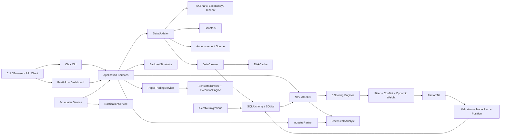
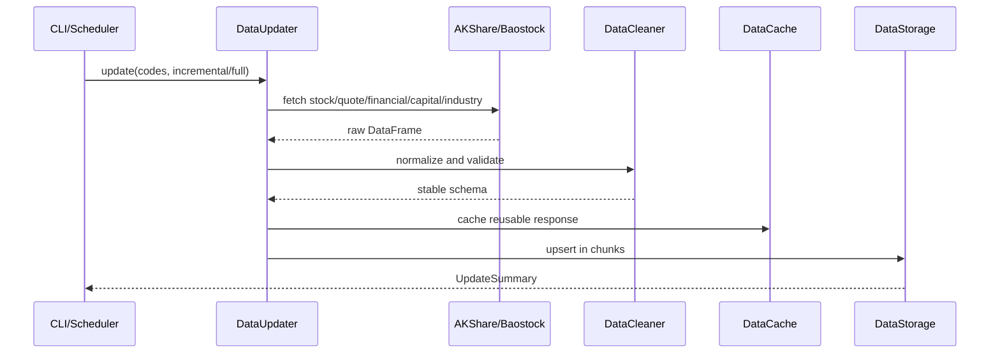
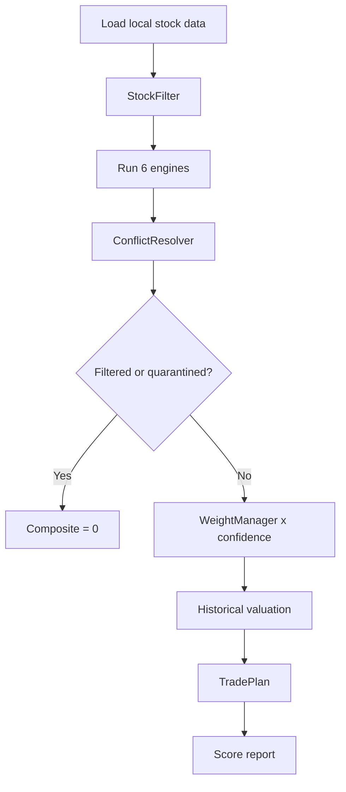
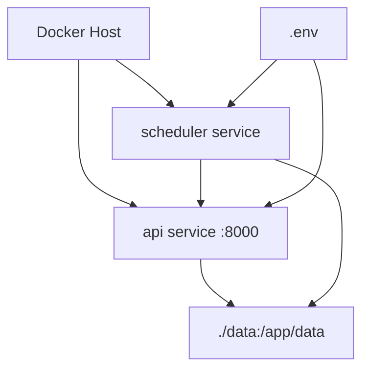

# AI 量化选股分析系统任务完成情况报告

> 报告日期：2026-08-06
>
> 项目目录：`/Users/zhangyifan/Documents/AI鉴股/ai-stock-analyzer`
>
> GitHub：<https://github.com/minsops/ai-stock-analyzer>
>
> 当前分支：`feature/route-a-productization-and-factor-research`
>
> 交付提交：以该分支最终 `HEAD` 为准
> 项目版本：`0.1.0`

## 1. 执行结论

本项目已完成一套可本地运行、可通过 CLI 和 REST API 使用、可用 Docker Compose 部署的 A 股研究与筛选系统。当前实现范围已超过原始阶段一 MVP，覆盖：

- AKShare 和 Baostock 数据采集、清洗、缓存、入库与增量更新。
- 价值、趋势、资金、行业、事件、消息六大可解释评分引擎。
- 市场状态识别、动态权重、信号冲突处理、风控过滤与综合排序。
- 低 PE、ROE、净利润同比、60 日反转的保守因子倾斜。
- 历史估值、仓位建议、交易计划、组合回测和因子 IC 研究。
- DeepSeek 自然语言研判和行业产业链分析。
- 全市场扫描、排行榜、CSV 导出、自选股、分组和评分阈值提醒。
- FastAPI、Swagger、服务端 HTML 仪表盘和 19 个 OpenAPI 路径。
- 容器内定时更新、扫描和通知调度。
- 模拟券商、风控下单引擎和等权模拟盘。
- Dockerfile、Docker Compose、健康检查与 API/scheduler 双服务部署。
- 自动化测试覆盖数据层、评分、融合、API、CLI、迁移、回测、LLM、模拟交易、安全边界和调度；准确数量与覆盖率见第 11 节的最终验收记录。

### 1.1 完成口径

| 口径 | 状态 | 结论 |
|---|---|---|
| `Codex_QA_Responses.md` 确认的阶段一范围 | 已完成 | Sprint 1-5 的数据层、引擎、融合、CLI、回测、API 都已落地 |
| 路线 A：产品化和可部署性 | 已完成一轮 | 仪表盘、排行、自选、提醒、导出、调度和 Docker 都已实现 |
| 路线 B：因子研究 | 已完成一轮 | 已完成 IC 框架、历史财务回填、样本外检验、回测和线上倾斜 |
| 阶段二/三本地基础模块 | 已实现 | 调度、通知、模拟券商、执行引擎和模拟盘已有本地实现 |
| 生产级实盘交易平台 | 未完成，不属于当前交付 | 未接入真实券商、实盘账户、鉴权、审计和生产告警 |
| 独立 React 前端 | 未实现，符合用户确认范围 | 当前是 FastAPI 直接返回的 HTML 仪表盘，原 QA 明确“前端暂不做” |

**结论：**按用户确认过的阶段一和后续“先 A 后 B”范围，任务已完成。如果把原执行文档中的未来规划也视为当前必须交付，则真实券商、多用户、独立前端和生产告警等仍属于后续工作。

## 2. 最终交付结果

### 2.1 代码规模

| 项目 | 数量 |
|---|---:|
| Git 跟踪文件 | 141 |
| Git 提交 | 使用 `git rev-list --count HEAD` 查询最终值 |
| `src/` Python 文件 | 66 |
| `scripts/` Python 脚本 | 14 |
| `tests/` Python 测试文件 | 36 |
| `src/` + `config/` 代码行数 | 约 5,913 |
| `scripts/` 代码行数 | 约 1,420 |
| `tests/` 代码行数 | 约 3,496 |
| OpenAPI 路径 | 19 |
| CLI 主命令 | 14 |
| SQLAlchemy 业务表 | 9 |
| 评分引擎 | 6 |
| 自动化测试 | 187 |

### 2.2 开源与版本控制

- 仓库：`https://github.com/minsops/ai-stock-analyzer.git`
- 功能分支：`feature/route-a-productization-and-factor-research`
- 本轮完成后会把功能分支推送到同名 GitHub 远端分支，并以最终 push 结果作为同步凭据。
- 许可证：仓库已包含 `LICENSE`
- 敏感信息：DeepSeek Key 仅应放在 `.env`，`.env` 被 Git 忽略；提交前敏感信息扫描未发现已跟踪密钥。

### 2.3 关键提交

| 提交 | 内容 |
|---|---|
| `b524dc9` | 首个开源版本 |
| `457fe08` | 补全 API 端点覆盖 |
| `25abb24` | 加固验证脚本和 CLI 安装 |
| `88159f2` | 新增 Docker 构建忽略文件 |
| `7a637a3` | 产品化仪表盘和因子 IC 研究框架 |
| `84f7e82` | 因子倾斜净成本回测与线上评分接入 |
| `1109373` 至 `d8d63df` | 系统补齐数据、存储、回测、风控和引擎边界测试 |
| `ff4f0da` | Docker pip 镜像源、超时和重试加固 |
| `745a3da` | Eastmoney 日线失败时自动回退到 AKShare 腾讯日线源 |
| `63e447c` | 恢复确认的仓位上限、行业上限和冲突处理规则 |
| `c61cd80` | 腾讯 fallback 成交额与进程级共享限流 |
| `6f5efbe` | 仪表盘动态内容转义和响应安全头 |
| `8216d91` | 评分本地化与扫描过滤覆盖生效 |
| `986007f` | Alembic 基线迁移和 repository 查询 |
| `f8937d6` | CLI 行为测试与公开函数类型门禁 |
| `a5fa547` | FastAPI/Pydantic 请求边界校验 |

## 3. 系统总体架构



### 3.1 架构特点

1. **本地数据库为中心**：数据更新阶段访问外部数据源，评分和排行阶段主要读取本地数据，避免 5,000 只股票评分时逐只调用网络接口。
2. **可降级**：外部数据源、DeepSeek 或某类指标不可用时，系统会返回空数据、降低置信度或使用明确的本地默认状态，不让单个依赖中断整个扫描。
3. **可解释评分为主**：六引擎输出分数、置信度和信号；LLM 只在已有量化结果上生成自然语言研判。
4. **研究与交易解耦**：评分引擎不直接下单；模拟交易通过 Broker 协议、RiskManager 和 ExecutionEngine 单独处理。
5. **配置外置**：数据库、数据采集、DeepSeek、并发数、因子倾斜和 API 端口均可用环境变量调整。

## 4. 项目目录与程序结构

```text
ai-stock-analyzer/
├── config/                       # 全局配置和日志
│   ├── settings.py
│   └── logging_config.py
├── src/
│   ├── api/                      # FastAPI、Pydantic schema、路由和 HTML 仪表盘
│   ├── backtest/                 # 组合回测和绩效指标
│   ├── broker/                   # Broker 协议和模拟券商
│   ├── cli/                      # Click 命令行入口
│   ├── data_layer/               # 数据源、清洗、缓存、存储和更新
│   ├── engines/                  # 六大评分引擎
│   ├── execution/                # 风控后的订单执行
│   ├── fusion/                   # 市场状态、权重、冲突、过滤、因子和排序
│   ├── industry/                 # 行业热度、行业内选股和行业映射
│   ├── llm/                      # DeepSeek 客户端与 AI 分析器
│   ├── notification/             # 通知协议和日志通知实现
│   ├── paper_trading/            # 等权模拟盘
│   ├── risk/                     # 仓位、订单风控和交易计划
│   ├── scheduler/                # 每日更新、扫描、消息、资金和提醒调度
│   └── valuation/                # 历史估值和同行比较
├── scripts/                      # 初始化、验证、回填、回测和因子研究脚本
├── migrations/                   # Alembic 迁移环境和版本脚本
├── tests/                        # 自动化测试
├── docs/                         # API、评分、因子、功能和本报告
├── data/                         # 数据库、缓存和研究产物，运行时生成
├── Dockerfile
├── docker-compose.yml
├── requirements.txt
├── pyproject.toml
├── README.md
├── HANDOFF.md
└── LICENSE
```

## 5. 核心代码结构和功能

### 5.1 `config/`

| 文件 | 职责 | 关键内容 |
|---|---|---|
| `config/settings.py` | 全局配置 | 路径、SQLite URL、采集延时/重试/超时、缓存 TTL、并发数、AKShare 直连域名、DeepSeek、过滤、仓位、回测和 API |
| `config/logging_config.py` | 日志初始化 | Loguru 格式、级别和输出配置 |

重要默认值：

- 采集请求间隔：`0.5s`
- 重试次数：`3`
- 重试间隔：`2s`
- 请求超时：`30s`
- 数据更新并发：`8`
- 单股最大仓位：`20%`
- 单行业最大仓位：`40%`
- 因子倾斜强度：`4.0`，设置为 `0` 可关闭

### 5.2 `src/data_layer/`

| 文件/类 | 已实现功能 |
|---|---|
| `fetcher.py::StockDataFetcher` | AKShare 股票列表、前复权日线、财务、估值、资金、行业和市场概览 |
| `fetcher.py::get_daily_quotes` | Eastmoney 主源失败时，自动调用 AKShare 腾讯日线源；对 `sh/sz/bj` 市场前缀和腾讯字段进行转换 |
| `baostock_source.py::BaostockFetcher` | 备用日线、财务、PE/PB/PS、指数成分、季度基本面和市场概览 |
| `cleaner.py::DataCleaner` | 中英文字段映射、日期、数值、代码、缺失值和稳定 schema 处理 |
| `cache.py::DataCache` | DiskCache 本地缓存、TTL、新鲜度和过期清理 |
| `storage.py::DataStorage` | SQLAlchemy 表初始化、分块 upsert、查询、排行、市场状态、自选和提醒 |
| `updater.py::DataUpdater` | 全量/增量、指定代码、样本股、指数成分、并发更新和单股失败跳过 |
| `news_source.py::NewsFetcher` | 按股票代码拉取近期公告/新闻标题 |

#### 数据采集链路



### 5.3 `src/engines/`

六个引擎都继承 `BaseEngine`，返回统一的 `ScoreResult`：

```text
score:       0-100 分
confidence:  0-1 置信度
signals:     中文可解释信号
available:   是否参与综合分
```

| 引擎 | 主要输入 | 主要评分内容 | 缺失处理 |
|---|---|---|---|
| `ValueEngine` | 财务、估值历史 | PE/PB 分位、ROE、营收和净利增速、股息率 | 缺子项不填 50，降低置信度 |
| `TrendEngine` | OHLCV 日线 | 均线、MACD、RSI、布林带、量能、ATR | 日线不足时降权或不可用 |
| `CapitalEngine` | 真实资金流或日线 | 主力净流入、北向、融资、股东户数 | 真实资金缺失时用量比、OBV、CMF、换手代理 |
| `IndustryEngine` | 行业指数和个股行业 | 20 日行业相对强弱、成交量变化、个股超额 | 行业数据不足时不参与 |
| `EventEngine` | 近期涨跌和波动 | 涨跌停、短期异常波动 | 事件稀疏时降低置信度 |
| `NewsEngine` | 近30日公告/新闻标题 | 规则词典利好、利空倾向 | 无消息时不参与或低置信 |

### 5.4 `src/fusion/`

| 文件/类 | 功能 |
|---|---|
| `regime_detector.py::RegimeDetector` | 使用沪深300、涨跌家数和资金信息判断市场状态 |
| `weight_manager.py::WeightManager` | 按 bull/bear/shock/extreme_fear/extreme_greed 调整六引擎权重 |
| `conflict_resolver.py::ConflictResolver` | 识别引擎分歧；极端分歧隔离，中等分歧按状态优先引擎或较低分处理 |
| `filter.py::StockFilter` | ST、新股、停牌、低成交额、PE 和负债率过滤；金融行业负债率豁免 |
| `factor_tilt.py::compute_factor_tilt` | 计算低 PE、ROE、净利同比、60 日反转组合 z-score，做行业和市值中性化 |
| `ranker.py::StockRanker` | 组装上述能力，执行单股评分和全市场扫描并落库 |

#### 市场状态权重

| 状态 | 价值 | 趋势 | 资金 | 行业 | 事件 | 消息 | 总仓位上限 |
|---|---:|---:|---:|---:|---:|---:|---:|
| 牛市 `bull` | 13% | 32% | 22% | 13% | 8% | 12% | 80% |
| 熊市 `bear` | 36% | 14% | 18% | 9% | 13% | 10% | 40% |
| 震荡 `shock` | 27% | 23% | 18% | 13% | 9% | 10% | 60% |
| 极度恐慌 `extreme_fear` | 40% | 5% | 22% | 8% | 13% | 12% | 20% |
| 极度贪婪 `extreme_greed` | 18% | 18% | 27% | 13% | 12% | 12% | 50% |

#### 单股评分链路



#### 全市场扫描链路

1. 从 `stocks` 表取全部有效股票。
2. 读取数据更新阶段写入的最近市场状态；空库按震荡降级，不访问外部行情。
3. 循环读取单股本地数据并评分；单股异常记录日志后跳过。
4. 只保留通过过滤且未隔离的股票。
5. 对评分截面施加保守因子倾斜。
6. 按最终分数排序并取 Top-N。
7. 写入 `scores` 表，供 API、仪表盘、导出和提醒使用。

### 5.5 `src/valuation/` 和 `src/risk/`

| 模块 | 功能 |
|---|---|
| `HistoricalValuation` | 计算个股 PE/PB 等指标的历史分位 |
| `PeerComparison` | 对同行股票的估值指标做横向对比 |
| `PositionSizer` | 根据综合分、市场状态和总资金生成仓位建议 |
| `TradePlan` | 生成操作方向、买入区间、止损、技术目标、价值目标和风险收益比 |
| `RiskManager` | 在模拟下单前检查数量、价格、现金、持仓和仓位上限 |

### 5.6 `src/backtest/`

`BacktestSimulator` 已支持：

- 周度或月度调仓。
- Top-N 等权持仓。
- `score` 综合分选股或 `momentum` 60 日动量对照。
- Point-in-time 财务切片，避免把未公布数据带回历史。
- 历史指数成分 membership，用于降低幸存者偏差。
- 佣金 `0.03%`、滑点 `0.1%`、卖出印花税 `0.1%`。
- 可选市场状态择时降仓。
- 总收益、年化收益、波动率、夏普、最大回撤、胜率和基准对比。

### 5.7 `src/industry/`

- `IndustryRanker.industry_strength()`：按行业成分股近一年收益中位数排行业热度。
- `IndustryRanker.select()`：在热门行业内调用单股评分器二次排序。
- 入选数量根据行业可用股票数动态调整，默认控制在 20-50 只。
- `sector_map.py`：把证监会行业映射到中证/沪深300一级行业。

### 5.8 `src/llm/`

| 文件/类 | 功能 |
|---|---|
| `client.py::DeepSeekClient` | 调用 DeepSeek OpenAI 兼容 `chat/completions`，支持超时、重试和内容解析 |
| `analyst.py::LLMAnalyst` | 把引擎分数、置信度、估值、市场状态、冲突和新闻压缩为上下文，要求模型返回结构化 JSON |

输出内容包含评级、置信度、结论、看多因素、看空因素、风险和建议动作。未配置 Key、账户不可用或请求失败时，会返回明确的降级结果，不影响规则评分。

### 5.9 `src/api/`

- `main.py`：创建 FastAPI app，注册全部路由和健康检查。
- `dependencies.py`：集中构造 Storage、Fetcher、Ranker 和 Analyst；市场状态优先读数据库，库空时才实时检测。
- `schemas.py`：Pydantic 请求/响应模型。
- `routes/`：个股、扫描、排行、市场、回测、行业、自选和仪表盘路由。
- `dashboard.py`：直接返回可用的 HTML/CSS/JavaScript 单页仪表盘，不依赖独立 Node.js 前端构建。

### 5.10 `src/cli/`

`pyproject.toml` 将 `ai-stock` 命令映射到 `src.cli.main:cli`。CLI 使用 Click 实现，使用 Rich/Plotext 输出中文报告和图表。

### 5.11 `src/scheduler/`、`notification/`、`broker/`、`execution/`、`paper_trading/`

| 模块 | 完成情况 |
|---|---|
| `SchedulerService` | 注册每日更新、可选资金、可选消息、扫描和自选提醒任务 |
| `NotificationService` | 支持多 Notifier 扇出；默认 `ConsoleNotifier` 输出日志 |
| `Broker` | 定义现金、持仓和订单协议 |
| `SimulatedBroker` | 实现内存买卖、现金变化和持仓更新 |
| `ExecutionEngine` | 下单前调用 RiskManager，通过后再转发到 Broker |
| `PaperTradingService` | 按候选池生成等权目标并执行本地模拟调仓 |

这些模块不会连接真实账户，也不会使用真实资金。

## 6. 数据库结构

默认数据库为 `data/db/stock_analyzer.db`，通过 `DATABASE_URL` 可指向其他 SQLAlchemy 兼容数据库。

| 表 | 主键/唯一键 | 用途 |
|---|---|---|
| `stocks` | `code` | 股票代码、名称、市场、行业、上市日期、ST 和有效状态 |
| `daily_quotes` | `code + trade_date` | 开高低收、成交量、成交额、换手和涨跌幅 |
| `financial_data` | `code + report_date` | PE/PB/PS、ROE、营收、净利、增长、毛利率、负债率、现金流和股息率 |
| `capital_flow` | `code + trade_date` | 主力净流入、北向、融资余额和股东户数 |
| `industry_index` | `industry_code + trade_date` | 行业指数名称、收盘、涨跌幅和成交量 |
| `scores` | `code + score_date` | 综合分、分引擎分数、市场状态和权重快照 |
| `news` | 公告标识 | 股票公告/新闻日期、标题、链接和来源 |
| `market_regime` | `trade_date` | 每日市场状态、置信度和详情 JSON |
| `watchlist` | `code` | 自选股、分组、上穿/下破评分提醒 |

项目已建立 Alembic 基线版本。`python scripts/init_db.py` 或 `alembic upgrade head` 可初始化空库、接管未版本化旧库并补齐旧自选表字段；运行时代码不再执行 `PRAGMA/ALTER TABLE`。`DataStorage.init_db()` 仍用于测试和内存库快速建表，正式结构升级以 Alembic 为准。

## 7. API 功能清单

基础路径：`/api/v1`

| 方法 | 路径 | 功能 |
|---|---|---|
| GET | `/` | HTML 仪表盘 |
| GET | `/api/v1/health` | 健康检查 |
| GET | `/api/v1/stock/{code}/score` | 单股规则评分 |
| GET | `/api/v1/stock/{code}/report` | 完整评分报告 |
| GET | `/api/v1/stock/{code}/ai-analysis` | 单股 DeepSeek 研判 |
| GET | `/api/v1/stock/{code}/valuation` | 历史估值分位 |
| GET | `/api/v1/stock/{code}/chart-data` | `60d/120d/1y` 图表数据 |
| POST | `/api/v1/scan` | 启动后台扫描任务 |
| GET | `/api/v1/scan/{task_id}` | 查询扫描任务状态 |
| GET | `/api/v1/ranking` | 按日期、Top-N 和行业查询排行 |
| GET | `/api/v1/ranking/export.csv` | 导出 Excel 可直接打开的 UTF-8 BOM CSV |
| GET | `/api/v1/regime` | 当前/最近市场状态 |
| GET | `/api/v1/position/suggest` | 仓位建议 |
| POST | `/api/v1/backtest` | 运行组合回测 |
| GET | `/api/v1/industry/hot` | 热门行业与行业内股票 |
| GET | `/api/v1/industry/chain` | 行业产业链和可选 AI 分析 |
| GET | `/api/v1/watchlist` | 查询分组自选和最新评分 |
| POST | `/api/v1/watchlist` | 添加/更新自选、分组和阈值 |
| GET | `/api/v1/watchlist/alerts` | 查询当前触发的提醒 |
| DELETE | `/api/v1/watchlist/{code}` | 删除自选 |

Swagger UI 默认地址：`http://127.0.0.1:8000/docs`

## 8. CLI 功能清单

| 命令 | 功能 |
|---|---|
| `ai-stock init-db` | 初始化数据库 |
| `ai-stock update-data` | 全量/增量更新，支持 AKShare/Baostock、指数、样本、代码和并发数 |
| `ai-stock update-news` | 更新公告/新闻 |
| `ai-stock update-capital` | 更新真实主力资金 |
| `ai-stock score CODE` | 单股六引擎评分和交易计划 |
| `ai-stock analyze CODE` | 单股评分 + DeepSeek 研判 |
| `ai-stock scan` | 全市场扫描和 Top-N 排行 |
| `ai-stock industry-scan` | 行业轮动、行业内选股和可选 AI 产业链 |
| `ai-stock regime` | 市场状态识别 |
| `ai-stock valuation CODE` | 历史估值分位 |
| `ai-stock position CODE` | 根据评分、状态和资金计算仓位 |
| `ai-stock backtest` | 组合回测 |
| `ai-stock serve` | 启动 FastAPI 和仪表盘 |
| `ai-stock schedule` | 常驻或 `--run-once` 执行每日更新、扫描和提醒 |

## 9. 研究与运维脚本

| 脚本 | 用途 |
|---|---|
| `scripts/init_db.py` | 数据库初始化 |
| `scripts/verify_sprint1.py` | 实盘拉取、清洗、写库、读取端到端验证 |
| `scripts/daily_update.py` | 每日增量更新 |
| `scripts/full_scan.py` | 全市场扫描 |
| `scripts/populate_financials.py` | 并行补全财务/估值数据 |
| `scripts/backfill_fundamentals.py` | 回填 point-in-time 历史季度基本面 |
| `scripts/fetch_backtest_history.py` | 拉取历史行情和指数成分 membership |
| `scripts/factor_research.py` | 因子中性化、rank-IC、IR、t 值、多空价差和样本外组合 |
| `scripts/factor_tilt_backtest.py` | 对比 baseline、倾斜和纯因子组合，包含交易成本 |
| `scripts/rank_ic_study.py` | 研究综合评分的横截面预测性 |
| `scripts/engine_ic_audit.py` | 审计各评分引擎的 IC |
| `scripts/classic_factor_ic.py` | 审计经典量价因子 IC |
| `scripts/trade_backtest.py` | 交易级买入、止盈止损和成本回测 |
| `scripts/exit_rule_study.py` | 对比不同退出规则 |

## 10. 因子研究结果

历史季度财务回填后，当前研究找到的稳健弱因子组合为：

1. `earnings_yield`：低 PE 价值。
2. `roe`：盈利质量。
3. `profit_yoy`：净利润同比增长。
4. `mom60`：60 日中期反转，代码中对动量方向做了反向处理。

已记录的样本外结果：

- IC 加权组合样本外 IC 约 `+0.034`，IR 约 `0.28`。
- 等权组合样本外 IC 约 `+0.035`，IR 约 `0.30`。
- 倾斜回测中 `tilt_1.0` 相对 baseline 的年化收益、夏普和最大回撤均有改善。

这组信号属于“弱而相对稳定”，不是强 alpha。线上默认只做温和倾斜，可以通过 `FACTOR_TILT_STRENGTH=0` 关闭。详细数据见 `docs/FACTOR_RESEARCH.md`。

## 11. 测试与验证结果

### 11.1 自动化测试

最终完整回归运行结果：

```text
187 passed, 1 warning
TOTAL coverage: 80.69%
```

唯一警告是 FastAPI TestClient 内部的 Starlette 第三方废弃警告，不是本项目测试失败。

测试覆盖：

- API 健康、个股、扫描、排行、CSV、自选、提醒和仪表盘数据。
- 非法代码、周期、数量、资金、提醒阈值、扫描过滤字段和回测日期统一返回 422。
- CLI 14 个命令入口、参数转发、空数据和调度 `--run-once`。
- Alembic 空库、未版本化旧库、重复升级、离线 SQL 和旧表补列。
- 仪表盘 HTML 转义、事件委托和三项响应安全头。
- AKShare/Baostock 抓取、缓存、清洗、更新、upsert 和异常降级。
- 六引擎正常值、边界值、缺失值和置信度。
- 过滤、冲突、权重、因子倾斜和排行。
- 历史估值、行业排行和行业映射。
- 回测时间点、调仓、风控、择时、membership 和绩效指标。
- DeepSeek 客户端解析、降级和分析器输出。
- Broker、ExecutionEngine、PaperTradingService、SchedulerService 和 NotificationService。
- 因子中性化、z-score、rank-IC 和研究函数。

### 11.2 AKShare 真实数据链路

2026-08-06 使用全新临时 SQLite 数据库和全新缓存目录运行 `scripts/verify_sprint1.py --code 000001 --days 30`：

```text
股票：000001
区间：2026-07-07 至 2026-08-06
Eastmoney：连续断开，触发自动回退
腾讯 AKShare 日线：成功
拉取并清洗：23 行
写入数据库：23 行
从数据库读取：23 行
最近交易日：2026-08-06
最近成交额：1,179,228,561 元（fallback 已补全 amount）
```

该结果证明的是真实远程拉取、字段转换、清洗、写库和读取整条链路，不是 mock 或旧数据缓存。

### 11.3 API、CLI、浏览器和 DeepSeek

2026-08-06 宿主机运行验收：

- `/api/v1/health`：HTTP 200，`25.5 ms`。
- `/openapi.json`：HTTP 200，`41.2 ms`，共 19 条业务路径。
- `chart-data?period=60d`：HTTP 200，返回 60 条；非法 `30d`：HTTP 422。
- 所有响应包含 `X-Content-Type-Options: nosniff`、`X-Frame-Options: DENY`、`Referrer-Policy: no-referrer`。
- Alembic 迁移后的空库中，根页面、`/regime`、`/ranking`、`/docs` 均返回 HTTP 200，耗时 `16.7-32.5 ms`。
- CLI `init-db`、`update-data` 隔离烟测、`position`、`regime`、`valuation`、`scan` 及 `score/backtest/serve --help` 全部通过。
- `compileall` 覆盖 `src/config/scripts/tests/migrations`，`pip check` 输出 `No broken requirements found.`。
- 应用内浏览器实测 1440×900 和 390×844 两种视口；移动端文档宽度 375px、无水平溢出，Top 20、排行点击和个股评分正常，控制台无错误。
- DeepSeek `deepseek-v4-pro` 通过个股 AI 分析接口返回中文评级、置信度、多空因素和操作字段。

### 11.4 Docker 构建和运行

2026-08-05 完成的验证：

- Docker Desktop daemon 正常。
- Python 3.11/Linux ARM64 完整依赖安装。
- `ai-stock-analyzer` 项目 wheel 构建并安装成功。
- 最终镜像构建成功。
- Compose API 容器运行并通过 `healthy` 检查。
- `/api/v1/health` 返回 `{"status":"ok"}`。
- `/docs` 返回 HTTP 200。
- OpenAPI 包含 19 个路径。
- 容器内已确认包含 AKShare 腾讯回退代码。

本机验证时 8000 端口被其他项目占用，临时映射到 8012；仓库内 Compose 仍使用标准的 `8000:8000`。

#### Docker 网络环境说明

本机 Docker Desktop 内置代理在拉取 PyPI 大文件时出现过 JSON 截断、wheel 哈希不一致和超时。为了分离“项目构建问题”与“Docker Desktop 网络问题”，最终验证镜像使用宿主机预下载的 Linux ARM64 wheelhouse 离线构建。

仓库的标准 Dockerfile 同时已加固：

- 支持 `PIP_INDEX_URL` 构建参数。
- 支持可选 `PIP_TRUSTED_HOST`。
- pip 超时为 120 秒。
- pip 重试为 10 次。
- 统一使用 `python -m pip`。

2026-08-06 最终验收时 Docker Desktop daemon 未启动，无法重新执行镜像构建；上面的容器结果是 2026-08-05 的历史验证。本轮已重新完成宿主机 API、迁移、CLI、浏览器和依赖验收。

### 11.5 性能验证

已执行的本地 SQLite 模拟数据扫描基准（180 个交易日、六引擎、因子倾斜）：

```text
1,000 只股票：13.175 秒，输出 Top 50，外部请求 0 次
线性外推 5,000 只：65.874 秒
5,000 条 scores 排行查询：平均 1.622 ms，最大 3.543 ms
```

该结果衡量本地评分计算，不包含首次全量网络采集、外部限流、大量磁盘 I/O 或 DeepSeek 请求。它证明“数据先入库，评分只读本地”的架构能满足原文档“5,000 只本地扫描小于 10 分钟”的目标。真实全市场耗时仍取决于数据库、磁盘、实际缺失数据和运行环境。

## 12. Docker 部署结构



### API 服务

- 启动：`uvicorn src.api.main:app --host 0.0.0.0 --port 8000`
- 端口：`8000:8000`
- 健康检查：`GET /api/v1/health`
- 重启策略：`unless-stopped`
- 数据卷：`./data:/app/data`

### Scheduler 服务

- 默认更新时间：17:30
- 默认扫描时间：18:00
- 时区：`Asia/Shanghai`
- 默认启用消息更新。
- 真实资金更新需在可访问 Eastmoney 的环境中加 `--with-capital`。

## 13. 未完成项和明确边界

### 13.1 真实券商和实盘

尚未实现：

- 真实券商登录和账户授权。
- 资金、持仓和委托同步。
- 真实下单、撤单、部分成交和成交回报。
- 交易日历、订单状态机、幂等、异常熔断和审计日志。
- 生产账户的人工确认和权限隔离。

### 13.2 生产级用户和 API 安全

尚未实现：

- 登录、JWT/Session、角色和权限管理。
- 多用户数据隔离。
- API 限流、请求审计和管理操作二次确认。
- HTTPS 反向代理和生产域名配置。

### 13.3 前端工程化

当前已有可用仪表盘，但尚未实现：

- 独立 React/Vue 前端工程。
- 组件化、前端路由、状态管理和前端自动化测试。
- 因子 IC、分组收益、回测归因和运行历史的交互可视化。

这一点符合用户在 QA 文档中确认的“阶段一暂不做 React 前端”。

### 13.4 数据完整性

- 真实主力资金仍依赖 Eastmoney 可用性。
- Baostock 不提供个股资金流，资金引擎会退化到量价代理。
- 北向资金、融资融券、股东户数、现金流质量和分红数据需要进一步补齐。
- 产业链关系没有免费完整的结构化数据源，当前主要依赖 DeepSeek 生成。
- 数据库文件和 Python 虚拟环境如被 macOS iCloud 自动变为 `dataless` 占位文件，会导致首次读取或 import 卡顿，建议将项目和 `.venv` 放在不被 iCloud 优化的路径。

### 13.5 研究局限

- 综合评分原始版本的截面 alpha 很弱。
- 当前因子组合样本外 IC 约 0.035，属于弱信号。
- 因子在同一段历史样本中被挑选，仍然存在过拟合风险。
- 历史回测不代表未来收益。
- 系统当前的合理定位是研究、筛选和监控工具，不是经验证的自动赚钱策略。

## 14. 环境与运行要求

### 14.1 软件要求

- Python `>=3.11`
- pip + `requirements.txt`
- 默认 SQLite，无需单独数据库服务
- 可选 Docker Desktop / Docker Engine + Compose
- DeepSeek 为可选外部依赖

### 14.2 快速运行

```bash
cd /Users/zhangyifan/Documents/AI鉴股/ai-stock-analyzer
python3 -m venv .venv
source .venv/bin/activate
python -m pip install -r requirements.txt
python -m pip install .
cp .env.example .env
python scripts/init_db.py
pytest -q
```

### 14.3 首次数据准备

```bash
# 小样本验证
ai-stock update-data --sample 30 --include-slow-data

# 或指定股票
ai-stock update-data --codes 000001,600519,300750 --include-slow-data

# 扫描和单股研判
ai-stock scan --top-n 10
ai-stock score 000001
ai-stock analyze 000001
```

### 14.4 Docker 运行

```bash
cp .env.example .env
docker compose up -d --build
docker compose ps
curl http://127.0.0.1:8000/api/v1/health
```

### 14.5 日常运行流程

```text
17:30  增量更新行情
       可选更新真实资金
       可选更新公告/新闻
18:00  检测市场状态
       全市场本地评分
       因子倾斜和 Top-N 落库
       检查自选股提醒
       仪表盘读取最新结果
```

## 15. 建议的后续优先级

### P0：稳定生产运行

1. 把项目、`.venv` 和数据库迁移到不被 iCloud 优化的目录。
2. 在能稳定访问国内行情源的 Linux 服务器运行 Docker Compose。
3. 完成数据新鲜度、调度历史和失败告警。
4. 接入至少一个真实通知渠道，例如企业微信、钉钉、飞书或邮件。

### P1：数据和产品完整性

1. 补齐资金、融资融券、股东户数、现金流质量和分红数据。
2. 后续结构变化继续追加 Alembic migration，并在 SQLite/PostgreSQL 两种方言做升级演练。
3. 增加调度任务状态、数据新鲜度和历史提醒页面。
4. 将因子和回测研究结果产品化为可交互页面。

### P2：量化研究深化

1. 使用滚动样本外和多市况持续检验当前因子组合。
2. 增加现金流质量、ROE 趋势、分析师预期和股东行为因子。
3. 建立组合优化、行业约束、市值约束、换手约束和风险归因。

### P3：实盘和多用户

1. 先实现券商只读账户同步。
2. 再实现必须人工确认的低权限下单。
3. 最后才评估强风控、可审计、可熔断的自动交易。
4. 如果需要对外服务，再增加用户、权限、租户隔离和 API 安全。

## 16. 验收结论

### 已经可用

- 本地初始化、数据更新、单股评分、全市场扫描、行业选股、估值、仓位和回测。
- REST API、Swagger、仪表盘、CSV 导出、自选股和提醒。
- DeepSeek 集成代码和失败降级。
- Docker 镜像构建、Compose API/scheduler 结构和健康检查。
- 本地模拟券商、风控执行和模拟盘。
- 因子 IC 研究、历史财务回填、净成本回测和线上倾斜。

### 尚不能宣称

- 不能宣称系统已经证明可稳定获利。
- 不能宣称已接入真实券商或可无人值守实盘交易。
- 不能宣称已具备生产级多用户鉴权和安全体系。
- 不能把 AI 生成的产业链和研判视为经过事实审核的结论。

**最终判定：**当前项目已达到“可运行的 A 股研究、筛选、监控、回测和模拟交易系统”的交付标准。它已经是一个功能完整的研究型产品，但不是已经经过实盘验证的自动交易平台。

## 17. 关联文档

- [README](../README.md)
- [API 文档](API.md)
- [评分逻辑](SCORING_LOGIC.md)
- [因子研究](FACTOR_RESEARCH.md)
- [功能清单](FUNCTIONS.md)
- [工作交接](../HANDOFF.md)
